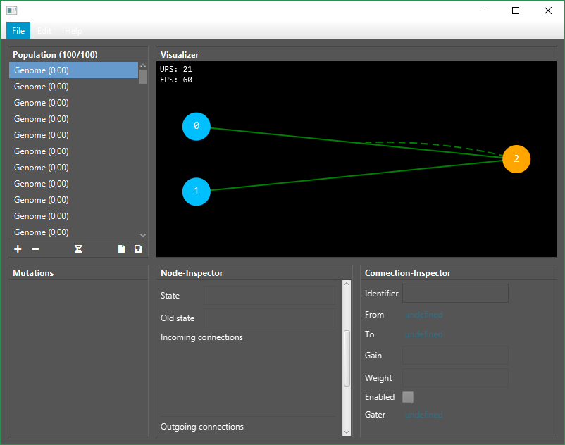

# Neat-Debugger

Debugging Tool for JNSTINCT (https://github.com/Kjosu/JNSTINCT)



## Features
- Add empty genome to population
- Remove genomes from population
- Save/Load genomes
- Select and crossover two genomes
- Colorized Nodes and Enabled/Disabled/Gated connections
- Choose genome from population
- Interactable node/connection inspectors
- Manually change weights/values of nodes/connections

## COMING SOON
- Dragable Nodes
- Node/Connection information inspector (Double-Click node/connection)
- Mutate per button click
- Single/Multi-step evolving per button click

## IDEAS
- Genome fitness tracking
- Genome gene size tracking
- Activate network with manual input
- Show step-by-step activation calculation

## Usage
```java
WIP
```
